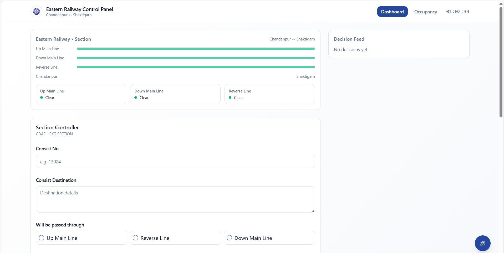

# 🚆 Section Controller: AI Decision Support for Indian Railways  

**Hackathon Project – Team Hackstronauts**  
Problem ID: 25022 | Theme: Transportation & Logistics | Category: Software  

---

## 📌 Overview  

The **Section Controller** is a modern decision-support system designed to assist Indian Railways section controllers in managing real-time complexity across high-traffic rail segments.  

Controllers must balance the **Working Time Table (WTT)** with unpredictable real-time disruptions such as delays, unscheduled events, and track closures. Our system augments their capabilities with **AI-powered decision support**, ensuring safety, efficiency, and reduced cognitive overload.  

Built with **React, TypeScript, Vite, Tailwind CSS, and Node.js**, the platform integrates modern web technologies with a hybrid AI framework that combines:  

- A **Formal Knowledge Base** (Railway rules and manuals as structured logic)  
- A **Predictive Engine** (ML-based forecasting and disruption detection)  
- An **Optimization Engine** (Genetic Algorithms, Reinforcement Learning, MILP)  
- **Safety Validation** (All decisions checked against non-negotiable safety rules)  

This ensures **human-in-the-loop decision-making** – AI assists, but human controllers remain in charge.  

---

## 🚩 Problem Statement  

Section controllers face multiple challenges in real-time operations:  

- ⚡ **Dynamic Conflict Resolution**: Constantly resolving scheduling conflicts across multiple trains.  
- 📊 **Information Overload**: Monitoring dashboards, coordinating with stations, referencing manuals simultaneously.  
- 🛑 **Safety Constraints**: All decisions must comply with the Absolute Block System and signaling logic.  

Traditional methods struggle with scalability and efficiency under these conditions.  

---

## 🧠 Technical Approach  

Our hybrid AI framework strengthens safety and efficiency through:  

1. **Formal Knowledge Base**  
   - Translates **G&SR, Subsidiary Rules (SR), Operating Manuals, WTT** into computable structured logic.  

2. **Predictive Engine**  
   - Forecasts demand, detects delays/disruptions, and anticipates conflicts using ML models.  

3. **Optimization Engine**  
   - Applies **Genetic Algorithms, Reinforcement Learning, and Mixed-Integer Linear Programming (MILP)** for conflict-free scheduling.  

4. **Safety Guarantee**  
   - All AI-generated solutions validated against safety rules before reaching the controller.  

5. **Human-AI Symbiosis**  
   - AI reduces workload but keeps **human oversight** central for adaptability and accountability.  

---

## ✨ Features  
- Section decision management  
- Track closure reporting  
- Occupancy tracking  
- Real-time conflict detection  
- Hybrid AI-powered decision support  
- Modern UI with reusable components (accordion, dialog, table, toast)  
- Built with **Vite** for fast development and **Tailwind CSS** for scalable styling  

---


## 🖼️ Screenshots

### Dashboard View
<p align="center">
   
</p>
<p align="center"><i>
The Dashboard provides a real-time overview of the section, showing the status of all lines (Up Main, Down Main, Reverse) and a feed of recent decisions. Controllers can quickly assess the operational state and input new section decisions using the form below.
</i></p>

### Occupancy View
<p align="center">
   
</p>
<p align="center"><i>
The Occupancy screen displays the live status of each station and loop in the section, color-coded for Free, Occupied, Maintenance, or Blocked. This helps controllers monitor track availability and manage train movements efficiently.
</i></p>


---

## 🏗 Project Structure  

├── client/ # Frontend React app
│ ├── App.tsx
│ ├── global.css
│ ├── components/ # UI and feature components
│ ├── hooks/ # Custom React hooks
│ ├── lib/ # Utility functions
│ └── pages/ # Page components
├── server/ # Backend API (Node.js/Express)
│ ├── index.ts
│ ├── node-build.ts
│ └── routes/ # API routes
├── shared/ # Shared code (API types, utils)
├── public/ # Static assets
├── index.html # Main HTML file
├── package.json # Project metadata and scripts
├── tailwind.config.ts
├── postcss.config.js
├── vite.config.ts # Vite configuration
└── README.md # Project documentation

---

## 🚀 Getting Started  

### Prerequisites  
- Node.js (v18 or higher recommended)  
- npm or pnpm  

### Installation  

```bash
# Clone repository

cd Section-Controller-main

# Install dependencies
npm install
# or
pnpm install
```

### Development
```bash
npm run dev
```
App runs at: [http://localhost:5173](http://localhost:8080/)

### Production Build
```bash
npm run build
```

### Linting
```bash
npm run lint
```

---

## ⚙️ Configuration

- Tailwind CSS → tailwind.config.ts, postcss.config.js
- Vite → vite.config.ts
- Backend API → server/routes/

---

## 🌍 Deployment

- Pre-configured with netlify.toml for Netlify deployment
- Static assets served from public/

---

## 📈 Impact and Benefits

🎛 Controllers: Reduced cognitive load, faster and more accurate decisions.

🚆 Passengers: Improved punctuality, fewer delays, safer journeys.

📦 Freight Operators: Efficient goods movement, reduced losses.

🇮🇳 Indian Railways: Better resource utilization, lower costs, increased safety.

🌱 Societal Impact: Trust, convenience, reduced stress, environmental benefits (less idling, fewer emissions).

---

## 📚 Research & References

Our approach is grounded in:

- Indian Railways General & Subsidiary Rules (G&SR)
- Operating Manuals of Zonal Railways
- Working Time Tables (WTT)
- Academic research on railway traffic management and optimization algorithms
- Studies on human-in-the-loop AI systems
- Case studies of global railway modernization

---

## 🤝 Contributing

Contributions are welcome!

Open an issue for feature requests or bug reports.

Submit PRs with detailed descriptions.

---

